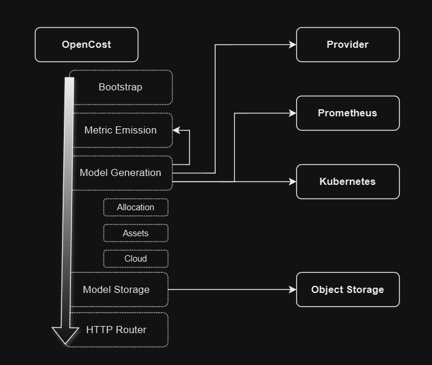

# Modular OpenCost 

This document proposes major architectural restructuring of the OpenCost project to include a more modular approach to collecting and emitting metrics, associating cost data, and providing a more extensible platform for development. It does not propose 

## Purpose 

OpenCost has concrete dependencies on Prometheus and PromQL for metric collection and querying. In addition to Prometheus, OpenCost also has dependencies on specific metric emitters, recording rules, metric relabeling,  the Kubernetes API, and provider specific cost data sources. These dependencies are tightly coupled in the core implementation with a bootstrapping process and HTTP router that are not easily extensible. This hinders the ability to extend or modify existing functionality, makes the code less approachable to contributors, makes optimization efforts difficult, and riddles the codebase with nuance and complexity. 

While solving all of these problems at once is not feasible, this proposal aims to layout the basic design and structure of a `DataSource` contract as a replacement for Prometheus, such that contributors can use to capture the goals and direction of the project more easily. 

## Components 

There are three driving data components of the OpenCost project: 
* Metric Collection and Queries: Prometheus is used to scrape specific emitters and expose a set of metrics that OpenCost requires to calculate cost. 
* Cloud Provider: More simply, a Provider is an abstraction that provides specific cost data for a given resource. This data is used to calculate the cost of a given resource. 
* Kubernetes API: The Kubernetes API is used as the glue between the raw metric data queried from Prometheus and the cost data gathered from the Provider. 

The interactions between these components are what drive the cost calculation process. However, the current implementation of OpenCost does not provide a clear separation of concerns between these components. Nor does it allow for substitution of these components without significant refactoring.

### Prometheus Data Source 

In the above diagram, the separation of concerns doesn't seem as impactful as previous descriptions. However, there are base contracts in place for both the Provider and Kubernetes APIs. However, the Prometheus implementation reaches all of the components from metric emission, through model generation, and finally exposed via the HTTP router _directly_. Not only does this require that OpenCost be run with a Prometheus instance, but it also requires that the Prometheus instance be configured in a specific way. 

More specifically, Prometheus is tightly coupled with model generation and metric emission. This restricts the ability to interface with other metric sources and hinders the expansion of new data models. 

The proposed `DataSource` contract would provide a more abstract interface for metric collection and querying. This would allow for the substitution of Prometheus with other metric sources, such as InfluxDB, or even an in-memory, low retention metric source for smaller footprint and/or testing. 

This also allows OpenCost to maintain the current data model and metric emission process, while allowing for the expansion of new data models and metric emitters. 

## Structure

Abstracting Prometheus provides a separation between core OpenCost functionality and specific implementation collecting the data required for cost calculation. It also clears up much of the nuance and complexity surrounding the Prometheus implementation that would otherwise prevent modifications to the core functionality. 

Structurally, each data source could be maintained within it's own go module inside of the opencost git repository. Those leveraging the OpenCost project as a dependency could more specifically select the modules required rather than inherit the entire kitchen sink. 

